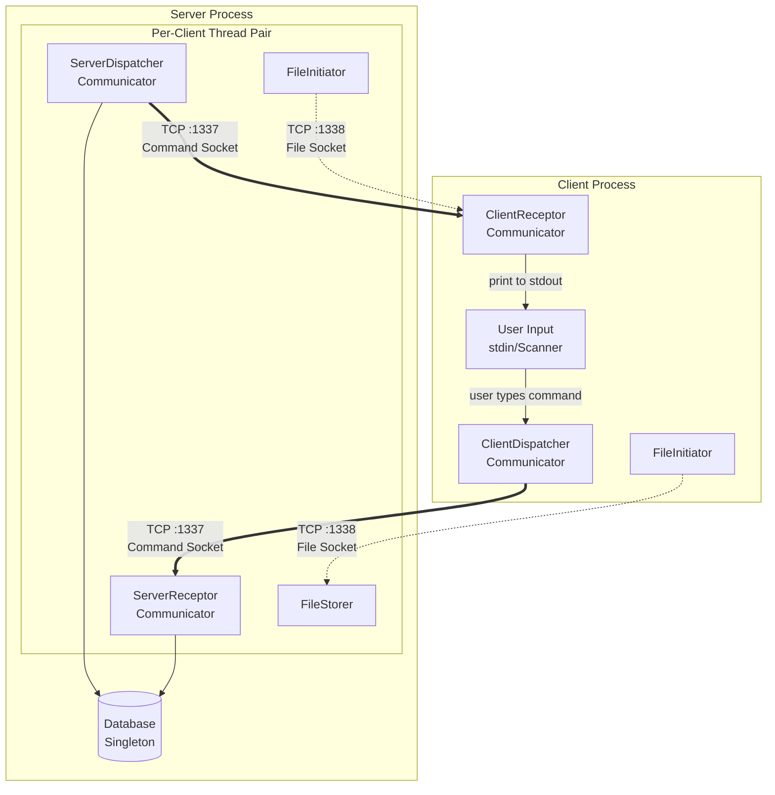
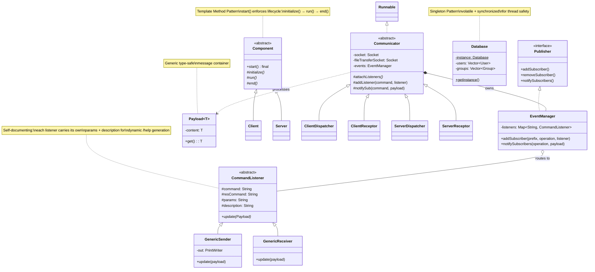
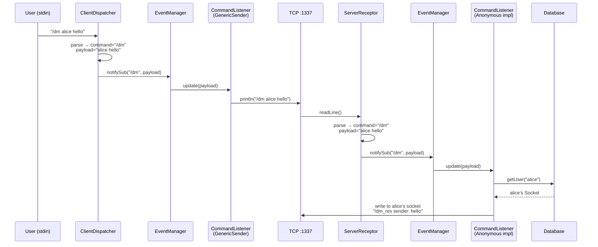
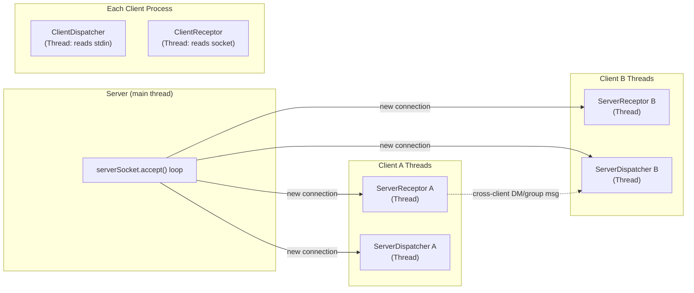

# CLiChat

A TCP socket-based client-server chat application built with pure Java — no frameworks, no dependencies. Features direct messaging, group chat with admin controls, and asynchronous file transfer over a dedicated socket channel.

## Software Architecture

### System Overview



### Design Patterns & Class Hierarchy



### Command Processing Flow



### Threading Model



### Key Architectural Decisions

| Decision | Rationale |
| --- | --- |
| **Dual-socket architecture** (`:1337` + `:1338`) | File transfers don't block the command/message channel — a large upload won't freeze chat |
| **Template Method** on `Component` | `start()` is `final` — subclasses can't break the lifecycle contract, only fill in the steps |
| **Observer/Publisher** for command dispatch | Adding a new command = adding one listener. No switch statements, no modification of dispatch logic |
| **Dispatcher/Receptor split** per connection | Clean separation: one thread blocks on user input (or socket read), the other blocks on socket write — no interleaving |
| **Generic `Payload<T>`** | Type-safe message passing without casting; serializable for potential future wire format changes |
| **`volatile` + `synchronized` Singleton** | Thread-safe lazy initialization of `Database` without unnecessary locking after first creation |
| **Self-describing `CommandListener`** | Each listener carries `params` and `description` — the `/help` command dynamically generates API docs from registered listeners |
| **`ScheduledExecutorService`** for file transfer timeouts | Async timeout handling without blocking the receptor thread — transfer requests auto-expire |

## Protocol

Commands are newline-delimited strings prefixed with `/`. The server responds with `/<command>_res` by convention.

```text
Client → Server          Server → Client
───────────────          ───────────────
/register user pass      /server Created user ...
/dm alice hello          /dm_res sender: hello  (to alice)
/group_create devs       /server group created
/group_join devs         /server group joined
/group_message devs hi   /group_message_res devs | user: hi  (to all members)
/group_leave devs        /group_leave_res You have left devs
/group_kick devs bob     /group_kick_res user kicked bob from devs
/file_init alice f.txt   /file_init_res ... reply with /file_accept <id>
/file_accept 1           /server f.txt
/logout                  (connection closed)
```
